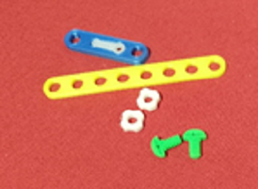

# Escornabot-STEMFIE
STEMFIE adaptation to Escornabot 

Electronics Stemfie es una llibreria STL de suports per tarjes de control, sensors i actuadors amb compatibilitat Stemfie.

Realitzada per [Jordi Mayné](https://github.com/maynej) des de Mechatronic Study 

STEMFIE es un projecte de construcció lliure, que s'imprimeix en 3D (http://stemfie.org) 

Tota la [documentació es pot trobar en PDF](https://github.com/maynej/Escornabot-Stemfie/tree/main/Doc).

STL per imprimir [aquí](https://github.com/maynej/Escornabot-Stemfie).

## Suports 3D
  
Descripció         | Imatge          | Arxiu         
------------- | ------------- | ------------- 
Suport CPU 2.12 | | [CPU 2.12](STL/CPUEscornaStemfie.stl)
Suport Motor Pas a Pas 28BYJ-48 | |[Motor 28BYJ-48](STL/28BYJ-48_MountingEscornabot2.stl)
Suport Servo-motor SG9 | | [ServoSuport 3H](STL/ServoSuport3HStemfie.stl)
Suport palanca Servo-motor SG9 | |[Adapter SG9](STL/Servo9GAdapter_Stemfie.stl)
Suport Sensor HC-SR04 | | [HC-SR04 Simetric 3H](STL/SensorAsimetric3H_Stemfie.stl) 

## Llicència

Creative Commons Attribution-NoComercial-ShareAlike 4.0 International (CC BY-NC-SA 4.0)  
